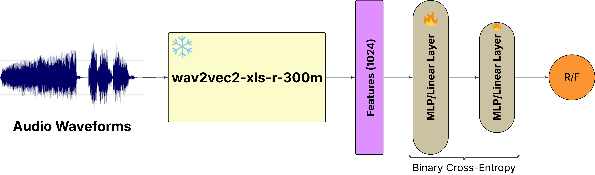
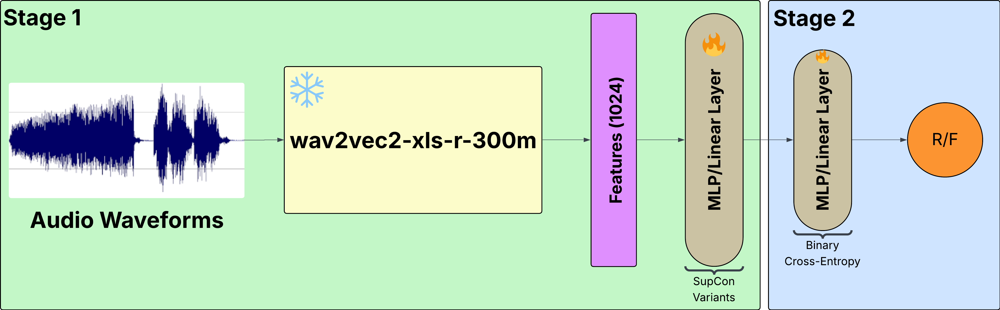

# wav2vec_contr_loss (experimental)

Training and evaluation for spoofed-speech detection using Wav2Vec2 encoders,
a lightweight compression head, and supervised contrastive losses. The repo
has two main pipelines:

- **Baseline**: end-to-end BCE classifier (Wav2Vec2 → head → BCE).
- **SupCon experiments**: Stage-1 contrastive training to learn embeddings,
  Stage-2 classifier on those embeddings, plus plotting and scoring utilities.

## Architectures

### Baseline

The baseline is an end-to-end binary classifier. Audio is encoded with
Wav2Vec2, compressed into a clip embedding, and trained with BCE. This
establishes the reference performance for all experiments.

### Experiments (SupCon variants)

All experiments share the same encoder and compression head, and differ only
in the contrastive objective or its hyperparameters:

- **Similarity choice**: cosine vs geodesic similarity.
- **Uniformity regularizer**: optional term with `uniformity_weight` and
  `uniformity_t`.
- **Hard-negative mining**: top-K mining with a warmup and ramped alpha.

The pipeline is consistent across experiments: Stage-1 learns embeddings with
SupCon, Stage-2 trains a lightweight classifier on those embeddings.

## Data

Only ASVspoof 19 LA Train set is used to train the models (baseline and all the experiments)and ASVspoof LA Dev set is used vor validation. Evaluation is done on ASVspoof 19 LA Eval and In The Wild datasets.