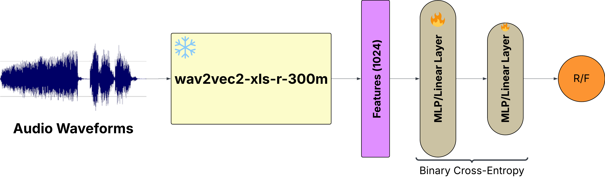
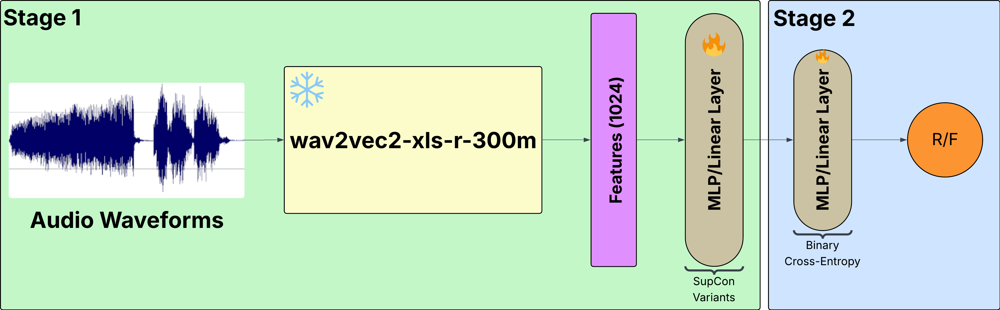
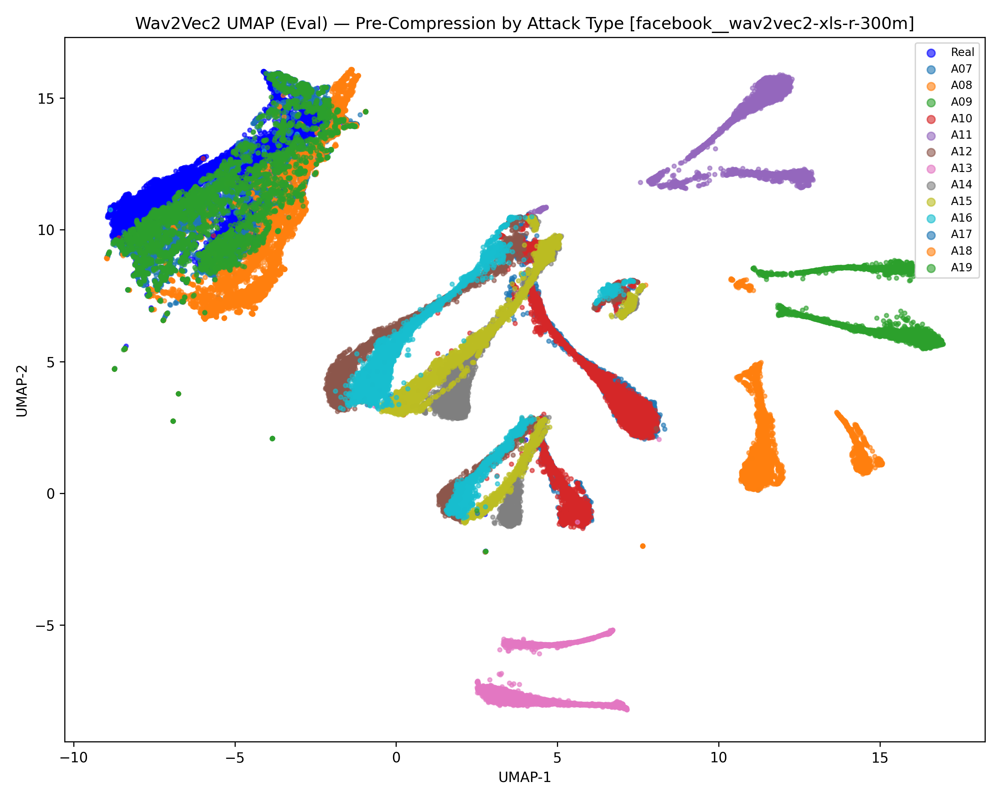
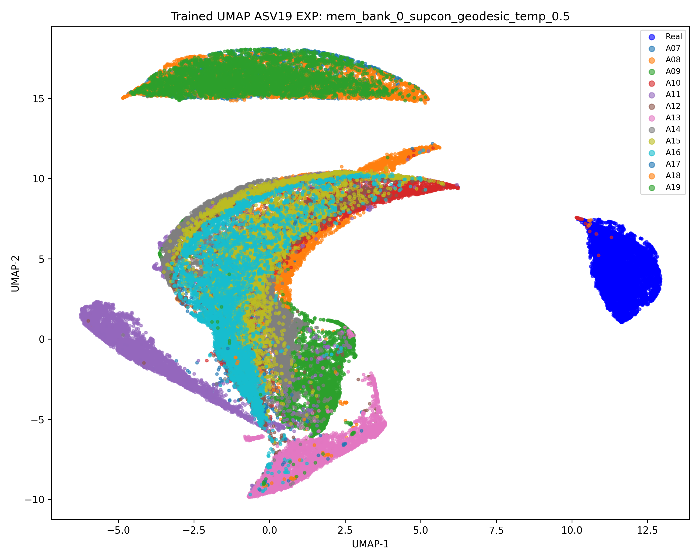
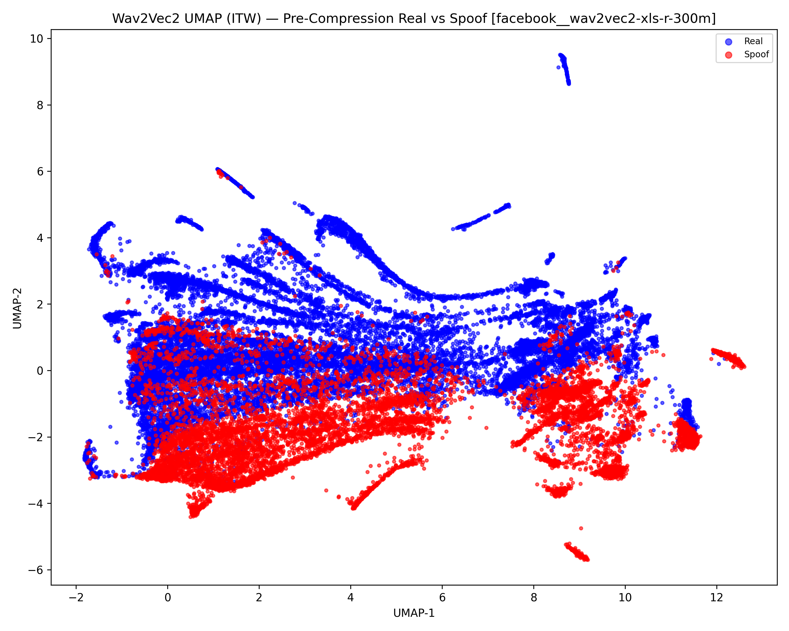
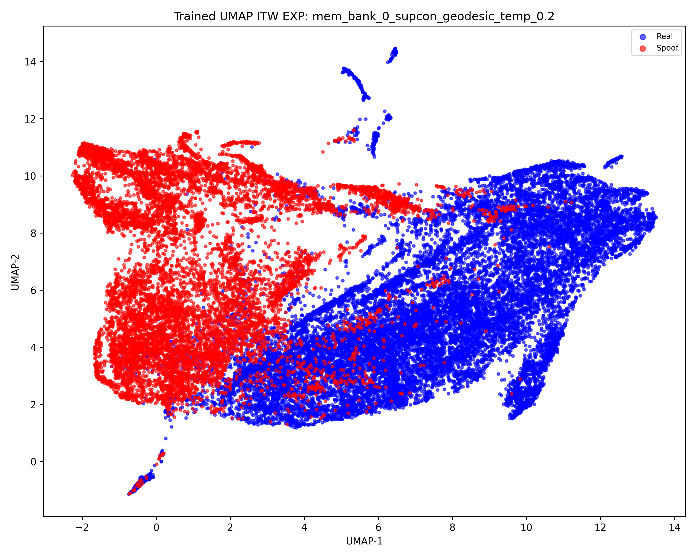

# Similarity Choice and Negative Scaling in Supervised Contrastive Learning for Deepfake Audio Detection

Code for the master's thesis and accompanying paper:
**[Similarity Choice and Negative Scaling in Supervised Contrastive Learning for Deepfake Audio Detection](https://arxiv.org/abs/2604.26057)**
Jaskirat Sudan, Hashim Ali, Surya Subramani, Hafiz Malik. arXiv 2604.26057

---

## What is this?

This repo implements a two-stage pipeline for deepfake audio detection using **[wav2vec2 XLS-R (300M)](https://huggingface.co/facebook/wav2vec2-xls-r-300m)** with supervised contrastive learning. The thesis studies two specific design choices in the contrastive objective:

1. **Similarity choice**: cosine vs. angular (geodesic) similarity on the unit hypersphere.
2. **Negative scaling**: whether expanding the negative set via a cross-batch memory queue helps or hurts, and why the answer differs between the two similarity functions.

Training is done on ASVspoof 2019 LA. The key evaluation is cross-dataset generalisation to In-The-Wild (ITW) — real-world deepfakes the model never saw during training.

---

## Architecture

### Baseline



End-to-end binary classifier: [Wav2Vec2 XLS-R](https://huggingface.co/facebook/wav2vec2-xls-r-300m) encoder + compression head + BCE loss.

### Two-stage SupCon pipeline



**Stage 1** trains the encoder and projection head with supervised contrastive loss to shape the embedding space. **Stage 2** freezes both and trains a linear classifier on the resulting embeddings with BCE. The two stages are fully decoupled.

---

## Learned Representations

UMAP projections showing what Stage 1 training does to the embedding space.

### ASVspoof 2019 LA eval (in-domain, coloured by attack type)

| Before Stage 1 | After Stage 1 |
|:---:|:---:|
|  |  |

### In-The-Wild (out-of-domain, real vs. spoof)

| Before Stage 1 | After Stage 1 |
|:---:|:---:|
|  |  |

On ITW, real (blue) and spoof (red) are massively overlapping before training. After Stage 1, they split into distinct regions — despite the model never seeing ITW data.

---

## Results

Training: ASVspoof 2019 LA. Metric: EER (%, lower is better).

| System | ASV19-LA | ITW | ASV21-DF | ASV21-LA | Pooled |
|---|---|---|---|---|---|
| Baseline (BCE) | 0.23 | 12.18 | 9.12 | 7.54 | 7.27 |
| Cosine SupCon (τ=0.30, no queue) | 0.35 | 9.99 | 6.58 | 6.18 | 5.78 |
| Geodesic SupCon (τ=0.07, no queue) | 0.25 | **8.70** | **6.16** | **6.11** | **5.31** |
| Cosine SupCon + queue (Q=2048) | 0.21 | 8.51 | 4.50 | 4.54 | **4.44** |

---

## Running

**Stage-1 contrastive training:**
```bash
python train_stage1.py \
  --supcon_similarity geodesic \
  --temperature 0.07 \
  --queue_size 0
```

**Baseline:**
```bash
python baseline_train.py
```

**Extract embeddings, then train Stage-2 classifier:**
```bash
python extract_stage1_embeddings.py --ckpt checkpoints_stage1/<run>/stage1_head_best.pt
python train_stage2_classifier.py --emb_dir encoder_embeddings/<run>/
```

**Evaluate on all datasets:**
```bash
python eval_datasets.py --ckpt_path checkpoints_stage2/<run>/
```

---

## Citation

```bibtex
@article{sudan2026similarity,
  title   = {Similarity Choice and Negative Scaling in Supervised Contrastive Learning for Deepfake Audio Detection},
  author  = {Sudan, Jaskirat and Ali, Hashim and Subramani, Surya and Malik, Hafiz},
  journal = {arXiv preprint arXiv:2604.26057},
  year    = {2026}
}
```
